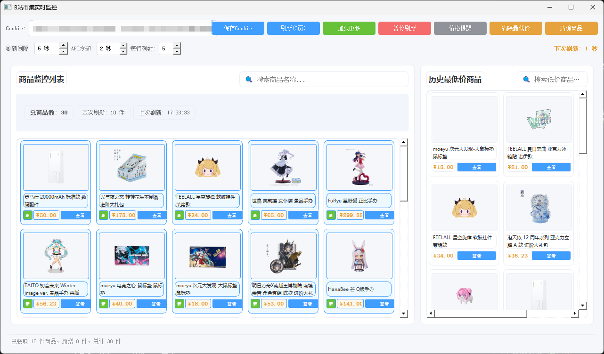
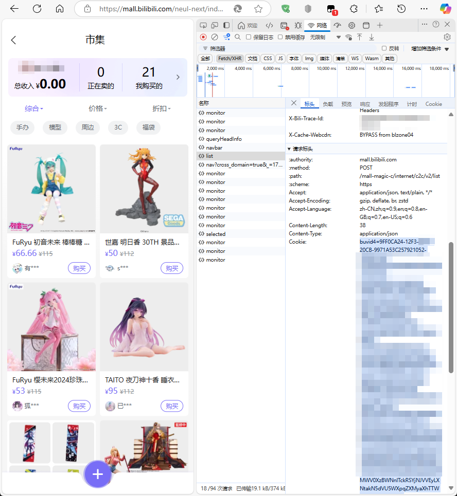

# B站市集监控工具 (BiliPrice Tracker)

这是一个用于监控B站市集（跳蚤市场）商品价格的工具，帮助用户追踪和发现最低价商品。通过定时自动刷新，实时监控商品价格变化，并提供历史最低价记录，方便用户比较和选择最优惠的商品。



## 功能特点

- **商品实时监控**：定时自动刷新B站市集商品，支持手动刷新和自动多页加载
- **暂停与倒计时**：可随时暂停自动刷新，并显示下次刷新倒计时
- **价格提醒功能**：设置价格阈值，当发现低于设定价格的商品时自动提醒
- **历史最低价记录**：保存并展示每种商品的历史最低价格
- **灵活的布局**：支持自定义每行显示列数，自适应窗口大小
- **商品筛选功能**：左右两侧均支持商品名称搜索
- **API请求保护**：内置API冷却时间设置，避免频繁请求被限制
- **数据持久化**：自动保存商品缓存和设置，程序重启后可恢复

## 安装方法

### 环境要求
- Python 3.6+
- PyQt5
- 其他依赖包

### 安装步骤

1. 克隆或下载本项目

2. 安装依赖
```bash
pip install PyQt5 requests
```

3. 运行程序
```bash
python shiji.py
```

## 使用说明

### 首次使用

1. 启动程序后，在顶部输入框中填入B站Cookie
2. 点击"保存Cookie"按钮保存Cookie信息
3. 程序会自动开始刷新，默认每5秒刷新一次

### 如何获取B站Cookie

获取Cookie是使用本工具的关键步骤，请按照以下步骤操作：

1. 使用Chrome或Edge等浏览器登录B站官网 (https://www.bilibili.com/)
2. 登录完成后，进入B站市集页面 (https://mall.bilibili.com/)
3. 按F12打开开发者工具（或右键点击页面，选择"检查"）
4. 在开发者工具中，选择"网络"（Network）选项卡
5. 在页面上进行任意操作（如刷新页面）
6. 在网络请求列表中，找到任意一个对B站的请求
7. 点击该请求，在右侧找到"Headers"选项卡
8. 向下滚动找到"Cookie:"开头的行
9. 复制该行完整的Cookie内容（不包含"Cookie:"字样）



10. 将复制的Cookie粘贴到程序顶部的Cookie输入框中
11. 点击"保存Cookie"按钮完成设置

**注意：** Cookie中包含您的登录凭证，请勿分享给他人，以免账号被盗用。

### 基本操作

- **刷新(3页)**：手动触发刷新，自动加载3页数据
- **加载更多**：在当前数据基础上加载更多商品
- **暂停刷新**：暂停自动刷新功能
- **价格提醒**：设置价格阈值，发现低价商品时提醒
- **清除最低价**：清除右侧历史最低价记录
- **清除商品**：清除左侧所有商品记录

### 设置项说明

- **刷新间隔**：自动刷新的时间间隔，单位为秒（最小5秒）
- **API冷却**：两次API请求之间的最小间隔时间，避免被限制
- **每行列数**：调整左侧商品展示的每行列数（1-12）

## 功能详解

### 商品展示区域

- **左侧面板**：显示所有监控到的商品，新刷新的商品会显示在最前面并标记为"新"
- **右侧面板**：显示历史最低价商品，按价格从低到高排序

### 价格提醒

1. 点击"价格提醒"按钮
2. 在弹出的对话框中输入价格阈值
3. 当发现价格低于阈值的商品时，会弹出提醒窗口
4. 在提醒窗口中可以查看所有低价商品，并支持直接查看商品详情或复制商品名称

### 暂停与倒计时

- 界面上会显示距离下次自动刷新的倒计时
- 点击"暂停刷新"可随时暂停自动刷新，再次点击恢复

### 自适应布局

- 程序会根据窗口大小自动调整商品展示的列数
- 也可以通过"每行列数"设置手动调整

## 注意事项

1. **Cookie设置**：需要正确设置B站Cookie才能获取数据
2. **API限制**：为避免被限制，建议将API冷却时间设置为2秒以上
3. **数据保存**：所有数据会自动保存，关闭程序后重新打开可恢复

## 常见问题

### Q: 为什么无法获取数据？
A: 请检查Cookie是否正确设置，或者API请求是否被限制。可以尝试增加API冷却时间。

### Q: 如何找到特定商品的历史最低价？
A: 在右侧面板的搜索框中输入商品名称关键词即可筛选。

### Q: 程序占用内存过高怎么办？
A: 可以定期使用"清除商品"按钮清理缓存，或减少自动刷新页数。

### Q: Cookie失效怎么办？
A: B站Cookie通常有效期较长，但如果遇到数据无法获取，可能是Cookie已失效，请重新获取Cookie并更新。

## 文件说明

- **shiji.py**：主程序文件
- **cookies.json**：保存Cookie信息
- **min_price_history.json**：保存历史最低价记录
- **product_cache.json**：保存商品缓存数据
- **settings.json**：保存用户设置 

## 免责声明

本工具仅供个人学习、研究和非商业用途使用，开发者不对任何用户因使用本工具而可能产生的任何直接或间接损失负责。使用本工具时请务必遵守以下条款：

1. **使用限制**：本工具仅供个人使用，请勿用于任何商业目的或违反相关法律法规的活动
2. **合理使用**：请合理设置刷新间隔和API冷却时间，不要过于频繁地请求数据，以免对B站服务器造成不必要的压力
3. **尊重版权**：本工具不存储或分发任何受版权保护的内容，仅用于获取公开的商品信息
4. **非官方工具**：本工具与哔哩哔哩（B站）官方无关，为非官方第三方工具
5. **遵守平台规则**：使用本工具时，用户必须遵守哔哩哔哩平台的服务条款和社区规则
6. **Cookie使用**：用户提供的Cookie信息仅存储在用户本地，不会被上传或分享给任何第三方
7. **法律责任**：用户应自行承担使用本工具的一切法律责任，开发者不对因使用本工具而导致的任何问题承担责任

使用本工具即表示您已阅读、理解并同意接受以上免责声明的所有条款。如果您不同意这些条款，请勿使用本工具。 